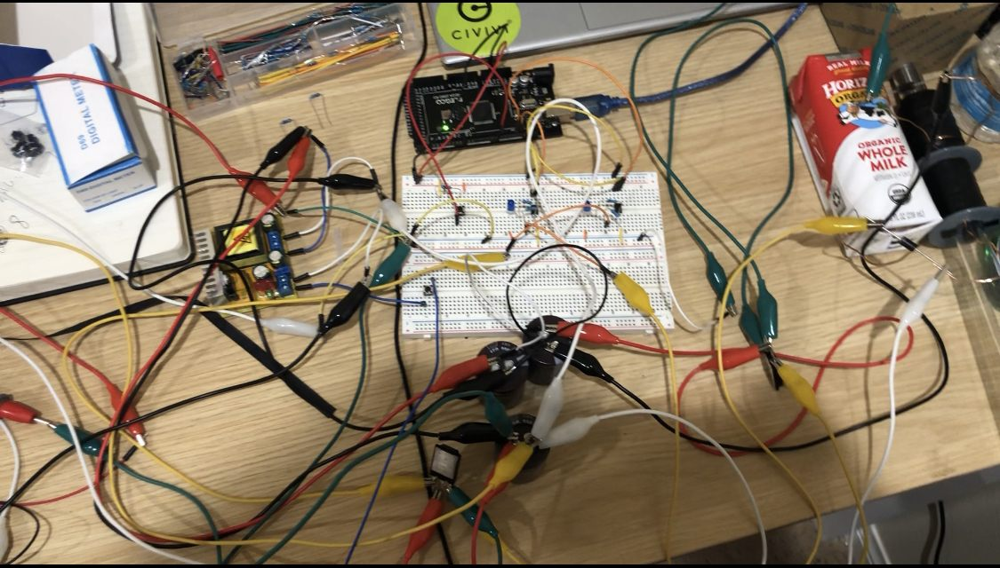
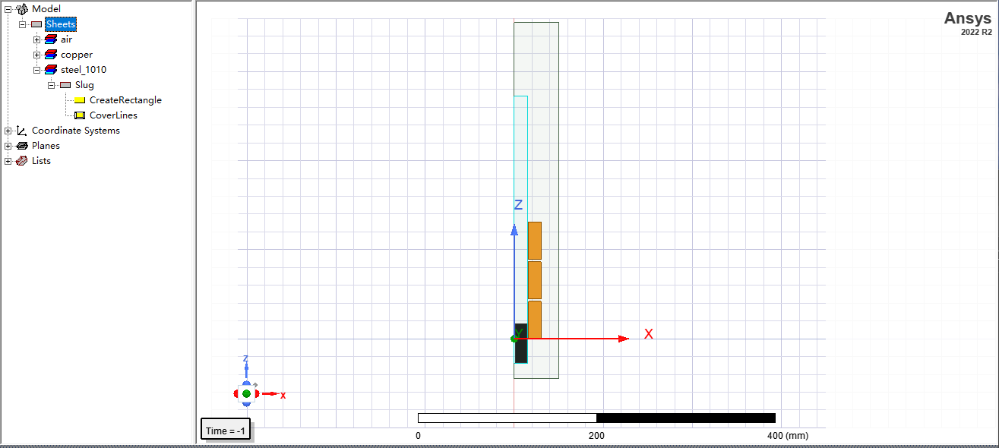
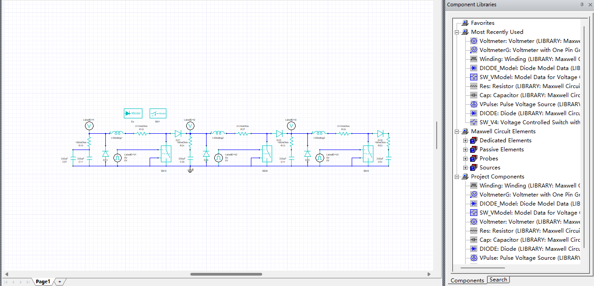
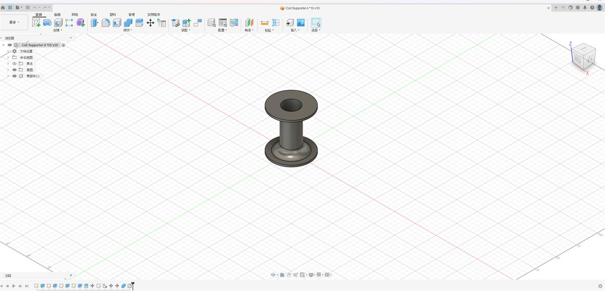
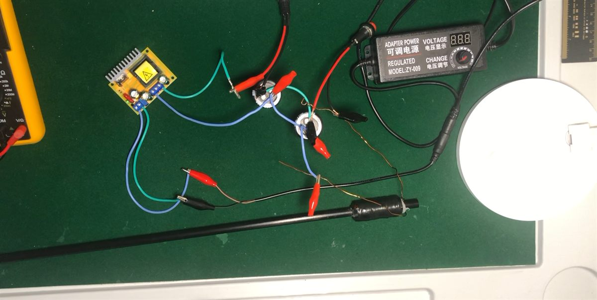
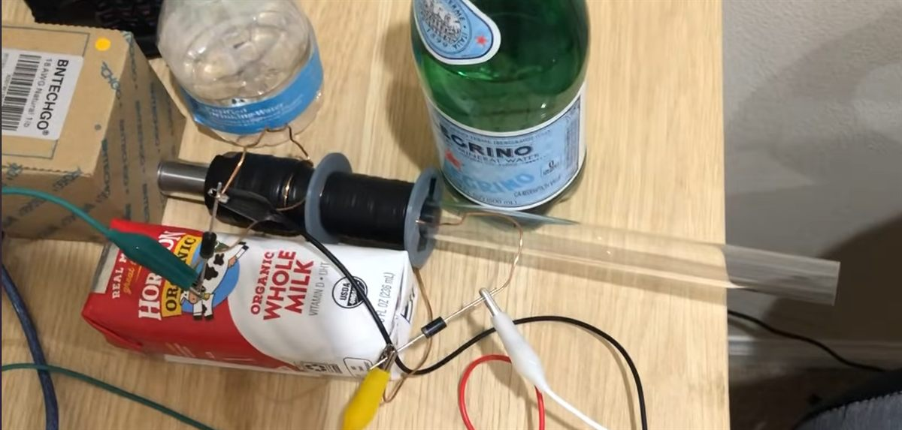

# Electromagnetic Accelerator

Stage-control firmware for a two-stage electromagnetic accelerator (coil gun) I have been designing, building, and rebuilding since 2022.

Three physical versions so far. The current build accelerates a **54.63 g** ferrous projectile to roughly **11 m/s** using four 400 V / 330 µF capacitors, with coil timing derived from ANSYS Maxwell 2D simulation rather than guesswork.

📖 **Full case study with photos, simulation captures, and video → [someheresy.github.io](https://someheresy.github.io/projects/electromagnetic-accelerator.html)**

---

## ⚠️ Safety

This repository is published as engineering documentation, not as a build guide. If you are not already comfortable working with high-voltage energy storage — bleeder resistors, discharge procedure, isolation between logic and the HV side — do not attempt to reproduce it.

---

## Results

| Metric | Value |
|---|---|
| Projectile velocity | ~11 m/s |
| Projectile mass | 54.63 g |
| Capacitor bank | 4 × 400 V / 330 µF (≈105 J) |
| Stages | 2, sequential |
| Control | Arduino, optocoupler-isolated switching |
| Timing source | ANSYS Maxwell 2D simulation |


*Version 3 — full bench setup*

---

## How the stage control works

Each stage is switched by a **pair** of optocouplers, upper and lower, so the Arduino never shares a ground path with the high-voltage side. The firmware drives both couplers of a stage together to close that stage's circuit, holds it for a fixed interval, then opens it.

Timing is **open loop**. Rather than sensing the projectile in flight, the delay between stages comes from the field and motion behaviour predicted in simulation. Version 2 tested a photoelectric sensing approach for closed-loop timing; it was not reliable enough at these speeds and was abandoned, which is what pushed the design toward a simulation-derived schedule.

### Pin assignments — `Stage Control/Coil-gun.ino`

| Constant | Pin | Role |
|---|---|---|
| `LP1` | 2 | Stage 1, upper optocoupler |
| `LP4` | 4 | Stage 1, lower optocoupler |
| `LP3` | 7 | Stage 2, lower optocoupler |
| `LP2` | 8 | Stage 2, upper optocoupler |
| `BUTTON_PIN` | 12 | Fire trigger (input) |

### Firing sequence

1. Fire button reads HIGH
2. `LP1` + `LP4` HIGH — stage 1 conducts
3. Hold **300 ms**, long enough for the projectile to reach stage 2
4. `LP1` + `LP4` LOW — stage 1 opens
5. *(Stage 2: `LP2` + `LP3` for 40 ms)*
6. Hold 1000 ms before the loop can retrigger

> **Note on the committed state:** step 5 is currently commented out, so this version of the firmware fires stage 1 only. The stage 2 block is left in place as the timing reference it was tuned to. Uncommenting it re-enables two-stage operation.

---

## Design process

**Electromagnetic simulation.** ANSYS Maxwell 2D was used to model the field and evaluate how coil geometry and current decay affect the force on the projectile through its travel. The output of that analysis is the stage timing the firmware implements.

| | |
|---|---|
|  |  |
| *Field model* | *Circuit model* |

**Mechanical design.** Coil supports and launcher geometry were modelled in Fusion 360 and 3D printed. Alignment was the limiting factor on repeatability — without rigid, concentric supports, two runs of the same configuration do not produce the same result.


*Fusion 360 coil support model*

---

## Version history

| Version | Focus | Outcome |
|---|---|---|
| **V1** (2022) | Single stage, 550 V | Established the basic charge–fire–measure loop |
| **V2** | Two-stage architecture, sensing experiments | Photoelectric timing tested and abandoned |
| **V3** | Functional two-stage, simulation-informed timing | ~11 m/s, mechanically repeatable |

| | |
|---|---|
|  |  |
| *V1 — early prototype and test bench* | *V3 — two-stage launcher assembly* |

---

## Repository layout

```
.
├── Stage Control/
│   ├── Coil-gun.ino                         # Current two-stage sequencer
│   └── Coil_gun_copy_20240911221906.ino     # Earlier single-stage version (Sep 2024)
└── assets/                                  # Photographs and simulation captures
```

---

## Known limitations

- **Open-loop timing.** The delay between stages is fixed. A projectile that leaves stage 1 slower or faster than modelled arrives at stage 2 off-schedule, and a mistimed stage actively decelerates it.
- **No in-flight measurement.** Velocity is measured after the fact rather than used as feedback.
- **Stage 2 disabled in the committed firmware** (see the note above).
- **Efficiency is low**, as it is for essentially all multistage coil guns at this scale. Most of the stored energy becomes heat and field collapse rather than kinetic energy.

## Next

Version 4 moves the controller to an **ESP32** to get interrupt-driven timing and enough headroom for closed-loop control — sensing the projectile mid-flight and firing stage 2 from measured position rather than a fixed delay, which is the problem V2 failed to solve.

---

## Related

- 🔗 [Portfolio case study](https://someheresy.github.io/projects/electromagnetic-accelerator.html) — full photo and video record across all three versions
- 🔗 [2026-summer-projects](https://github.com/SomeHeresy/2026-summer-projects) — the OLED control-panel prototype (`EMCG Control`) intended for this system
- 📺 [Build and test footage](https://www.youtube.com/@SomeHeresyGaming)

---

**Calvin Yang** · Computer Science & Engineering, UC Irvine
[Portfolio](https://someheresy.github.io/) · [LinkedIn](https://www.linkedin.com/in/calvinyang07/) · [Email](mailto:calviny7@uci.edu)
